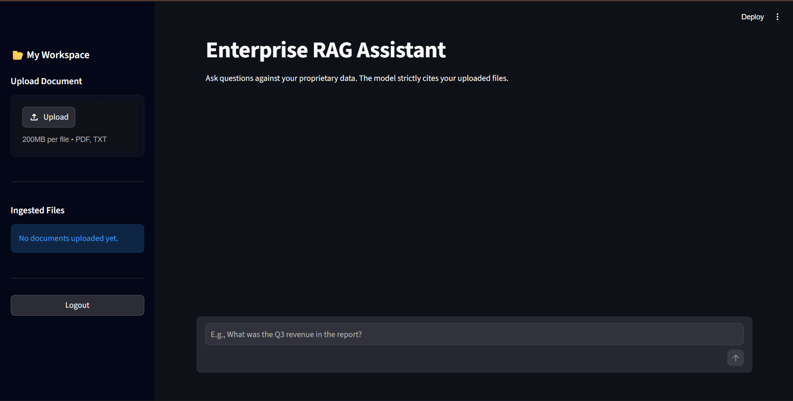
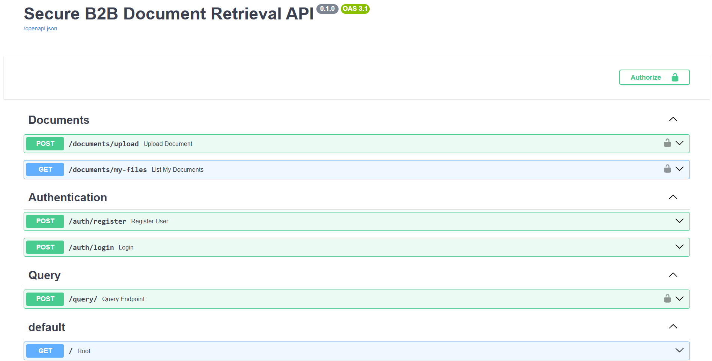
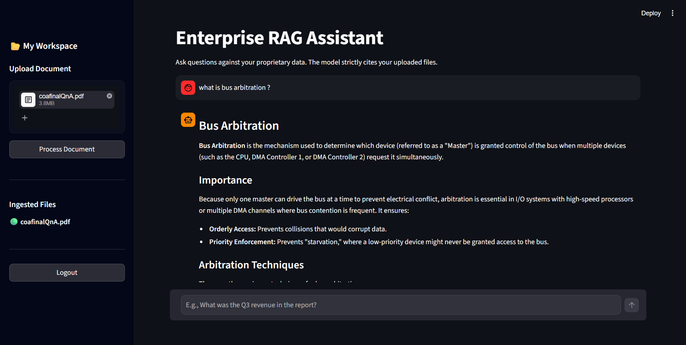

# 🔒 Secure B2B RAG Platform

An **enterprise-grade, multi-tenant Retrieval-Augmented Generation (RAG) platform** designed for B2B SaaS environments where **data isolation, retrieval quality, and API security** are critical.


## 🚀 The Problem It Solves

When companies deploy LLMs internally, the biggest risk is:

> ❌ **Data Leakage** — User A retrieving User B’s proprietary data

### ✅ Solution

This platform ensures:

* **Strict multi-tenant isolation at the database level**
* **Advanced hybrid retrieval pipeline**
* **Hallucination-resistant responses**


## ✨ Core Features


## 🧠 Advanced RAG Architecture

### 🔍 Hybrid Search

* Combines:

  * Dense Vector Search → *ChromaDB + BGE Embeddings*
  * Sparse Search → *BM25*
* Captures:

  * Semantic meaning ✅
  * Exact keyword matches ✅

### 🎯 Cross-Encoder Reranking

* Model: `ms-marco-MiniLM-L-6-v2`
* Re-ranks results **mathematically**
* Ensures **top-k = most relevant chunks**

### 🔁 Multi-Query Rewriting

* Uses a smaller LLM to:

  * Rewrite poorly phrased queries
  * Improve retrieval quality

### 🧾 Strict Guardrails

* Enforced via **Pydantic structured outputs**
* Guarantees:

  * Proper formatting
  * Source attribution
  * No hallucinated structure

## 🛡️ Enterprise Security

### 🔐 Multi-Tenancy

* Each document + embedding linked to:

  ```text
  tenant_id
  ```
* Ensures:

  * Complete data isolation
  * No cross-user leakage

### 🔑 JWT Authentication

* Secure login & registration
* Passwords hashed using **bcrypt**

### 🚦 Rate Limiting

* Implemented via **SlowAPI**

| Endpoint | Limit           |
| -------- | --------------- |
| Login    | 5 requests/min  |
| Query    | 10 requests/min |

👉 Prevents:

* brute-force attacks
* API abuse
* LLM cost spikes 💀

## 🏗️ Production Infrastructure

### ⚡ Blazing Fast Builds

* Uses **uv** (ultra-fast Python installer)
* Cuts dependency install time → seconds 🚀

## 📦 Optimized Images

- Multi-stage Docker architecture separating frontend and backend  
- GPU-accelerated environment leveraging CUDA for high-performance inference  
- Optimized dependency installation using `uv` to reduce build time and overhead  

> Designed for high-performance AI workloads with efficient build pipelines 

### 🛠️ Graceful Degradation

* Built-in retry mechanism
* If LLM fails:

  * retries automatically
  * fallback response returned
* Prevents:

  * server crashes
  * broken responses

## 🛠️ Tech Stack

| Layer            | Technology                   |
| ---------------- | ---------------------------- |
| Frontend         | Streamlit                    |
| Backend          | FastAPI, SQLAlchemy, SlowAPI |
| AI Orchestration | LangChain                    |
| Generation Model | Gemma 31B (Ollama Cloud)     |
| Query Rewriting  | Gemma 4B (Google GenAI)      |
| Vector DB        | ChromaDB                     |
| Sparse Search    | BM25                         |
| Evaluation       | RAGAS                        |


## 🚦 Getting Started

### 📌 Prerequisites

* Docker + Docker Compose
* API Keys:

  * Google Gemini → `GOOGLE_API_KEY`
  * Ollama Cloud → `OLLAMA_API_KEY`

### ⚙️ Installation

#### 1️⃣ Clone the repo

```bash
git clone https://github.com/Veror245/Secure-B2B-Document-Retrieval-API.git
cd Secure-B2B-Document-Retrieval-API
```

#### 2️⃣ Create `.env`

```env
GOOGLE_API_KEY=your_google_api_key_here
OLLAMA_API_KEY=your_ollama_api_key_here
SECRET_KEY=your_jwt_super_secret_key
```

#### 3️⃣ Run the app

```bash
docker-compose up --build -d
```

#### 4️⃣ Access

* 🌐 Frontend: [http://localhost:8501](http://localhost:8501)
* ⚙️ API Docs: [http://localhost:8000/docs](http://localhost:8000/docs)


## 📊 Evaluation & Benchmarking

This system was evaluated using the **RAGAS framework** on the **SQuAD dataset**.


### 🧪 Ablation Study: Hybrid Search Impact

| Metric            | Dense Only | Hybrid (Dense + BM25) | Impact        |
| ----------------- | ---------- | --------------------- | ------------- |
| Faithfulness      | 1.0000     | 1.0000                | Perfect       |
| Answer Relevancy  | 0.8632     | 0.8678                | +0.5%         |
| Context Precision | 0.7744     | 0.9033                | **+16.6% 🚀** |
| Context Recall    | 0.9200     | 0.9200                | Maintained    |


### 🧠 Key Insight

> Hybrid search dramatically improves **Context Precision**, ensuring the correct chunk is ranked first — minimizing hallucinations.


## 🤝 Future Roadmap (v2.0)

* 🗄️ PostgreSQL migration (replace SQLite)
* ⚡ Semantic caching (reduce LLM calls)
* 🌐 Agentic web search fallback
* 🧠 Smarter multi-agent orchestration


## 📸 Screenshots

### 🖥️ Frontend Interface


### ⚙️ Backend API (Swagger Docs)


### 🔍 RAG Query Results


